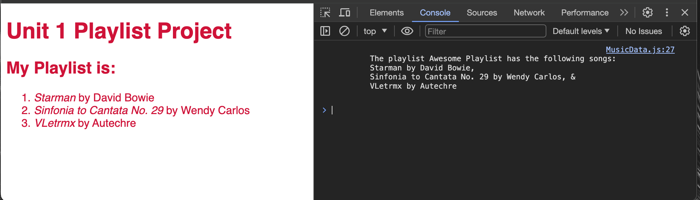

# Unit 1 Project - *making a playlist with classes* 

## Summary
In this project you will add Javascript code to two JS files: `script.js` and `MusicData.js`. In `MusicData.js` you will declare three classes:
1. `Song`
2. `Musician`
3. `Playlist`

You will then export these classes and import them into `script.js` where you will define three `Artists`, one `Song` for each for the artist and then a `Playlist` that holds all three songs.

### Accessing the Assignment Materials
1. Navigate to the assignment repository in the course [GitHub organization](https://github.com/MUST4707)
2. Click on the green `Use this template` button in the top right corner.
3. Choose 'Create a new repository'
4. Set up the repo name under your account.
5. Click `Create repository`

*You should now be at your own personal repository with the assignment materials.*
6. Click on the green `<> Code` button and select `Open with GitHub Desktop

*You should now be in your GitHub Desktop application that has a pop up window called 'Clone a Repository'*

7. Make sure the local path is where you would like to save this repo.
8. Hit `Clone`
9. You should be able to now click the `Open in Visual Studio Code ` button or navigate to your files and open the folder in Visual Studio Code.
10. After you finish working on your project please return to GitHub Desktop and
    1. Commit your changes to the `master` (don't to add a summary description)
    2. Click on the `Push Orgin` to sync your commit with the GitHub cloud.

## Instructions

Pick three songs that you would like to have on a playlist. Each song must be by a different artist.

For each musician you will need to know:
1. name
2. instrument
3. genre

For each song you will need to know:
1. title
2. artist
3. album

### MusicData.js
In `MusicData.js`:
1. Declare a class called `Song`, it's constructor should take three parameters:
    - `title`
    - `artist`
    - `album`
2. Declare a class called `Musician`, it's constructor should take three parameters:
    - `name`
    - `instrument`
    - `genre`
3. Declare a class called `Playlist`, it's constructor should take four parameters:
    - `name`
    - `song1`
    - `song2`
    - `song3`
    - `song4`
4. Your `Playlist` class should also define a method called `getInfo()` that prints text to the console saying:
    > `The playlist` (whatever name you give it) `has the following songs:` 
    > 
    > (Song1 name) `by` (Song1 Artist Name)`,`
    > 
    > (Song2 name) `by` (Song2 Artist Name)`, &`
    > 
    > (Song3 name) `by` (Song3 Artist Name)`.`
5. Export all three classes to make them available to the other JS files.
### script.js
In `script.js`:
1. Import all three objects `{Song, Musician, Playlist}` that you created in the `./MusicData.js` module file
2. Declare a new constant and assign to it a new `Musician` object to describe the musician for the first song.
3. Declare a new constant and assign to it a new `Musician` object to describe the musician for the second song.
4. Declare a new constant and assign to it a new `Musician` object to describe the musician for the third song.
5. Declare a new constant and assign to it a new `Song` object to describe the first song
    - _make sure to use the `Musician` object from step 2 in creating this `Song` object_
6. Declare a new constant and assign to it a new `Song` object to describe the second song
    - _make sure to use the `Musician` object from step 3 in creating this `Song` object_
7. Declare a new constant and assign to it a new `Song` object to describe the third song
    - _make sure to use the `Musician` object from step 4 in creating this `Song` object_
8. Declare a new constant called `myPlaylist` and assign to it a new `Playlist` object and make sure to use the three `Song` objects from steps 5, 6, & 7 when creating the `Playlist` object.
    - **It must be called `myPlaylist`!!!**
9. Call the `.getInfo()` method on `myPlaylist`

### Debugging
To make sure that your project is working correctly. Open the entire repository folder in Visual Studio Code and hit the "Go Live" button. You should see something similar to the below image. The webpage should be displaying the information from your playlist object. The information should also appear in the console.

### Submission
1. Commit your updated `script.js` and `MusicData.js` files to your project repository.
2. Submit the URL of your GitHub Repo to Canvas
